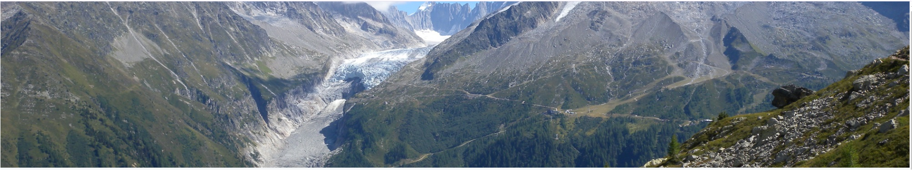
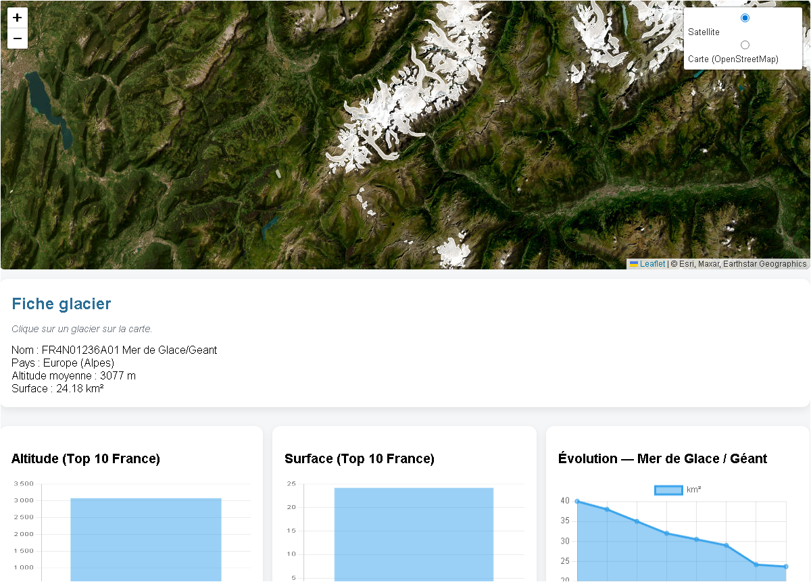
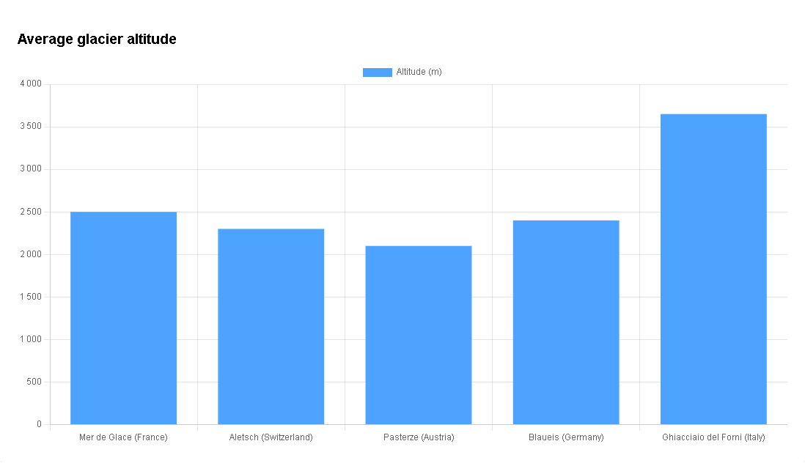
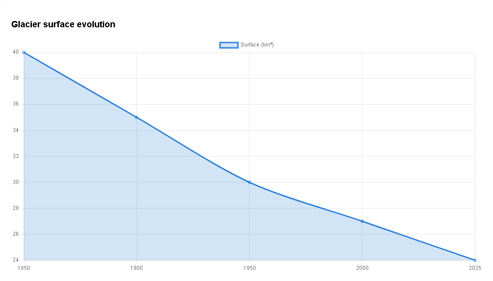
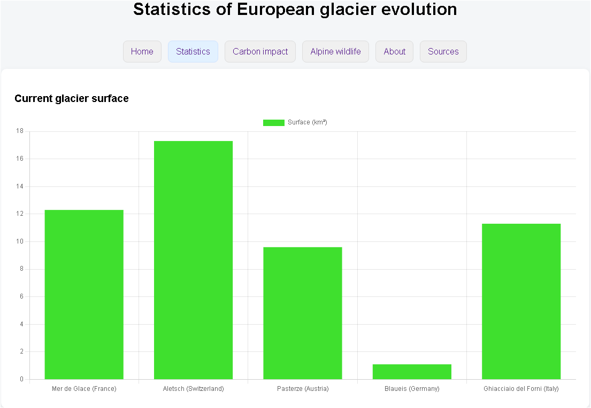
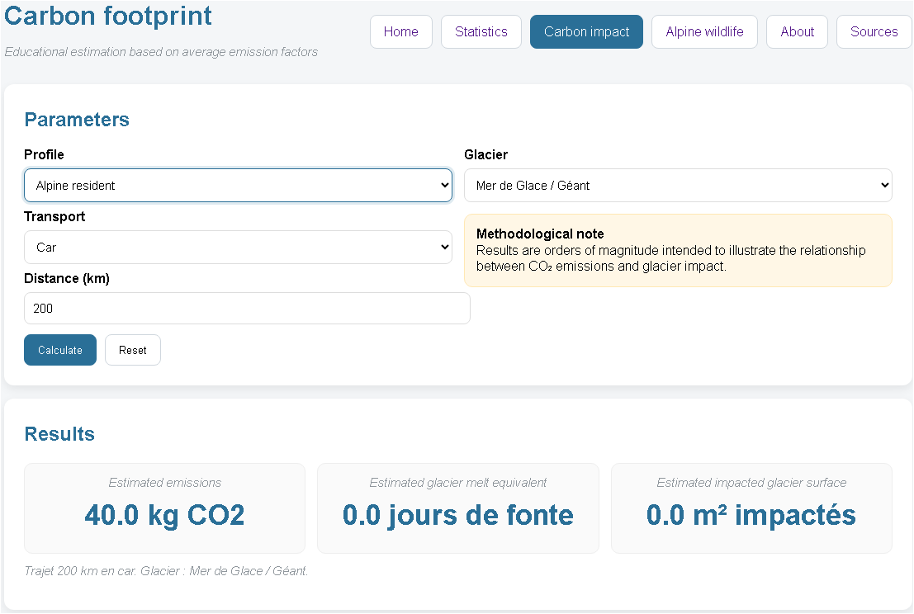
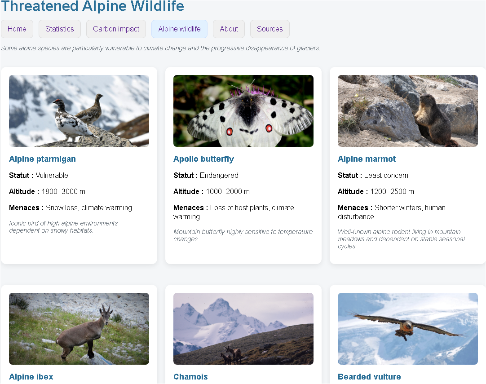

# 🌍 Glacier Map — Alpine Glacier Visualization Platform

Glacier Map is an educational and scientific web platform designed to visualize and understand the evolution of Alpine glaciers.

The goal of the project is to make glaciological and climate data accessible to the public, students and local institutions through interactive maps and visual dashboards.

The platform combines **geospatial visualization**, **climate indicators**, and **modern web infrastructure**.

---

# 🚀 Live Demo

Coming soon:

https://glacier-map.org

## 📸 Screenshots

### Interactive Glacier Map

### Glacier Statistics Dashboard

### Carbon Footprint Estimator

### Alpine Wildlife Awareness
---

---

# 🎯 Features

• Interactive map of Alpine glaciers (Leaflet)

• Glacier statistics dashboards (Chart.js)
  - altitude
  - surface
  - evolution

• Educational carbon footprint estimator

• Alpine wildlife awareness section

• Scientific sources and references

• Responsive web interface

---

# 🧱 Architecture

The application follows a simple modular architecture:

Users
│
Frontend (Leaflet + Chart.js)
│
Flask REST API
│
Glacier datasets / Database

---

# 🖥️ Frontend

Technologies:

- HTML
- CSS
- JavaScript

Libraries:

- **Leaflet** — interactive maps
- **Chart.js** — data visualization

Responsibilities:

- glacier map rendering
- dashboards display
- user interaction

---

# ⚙️ Backend

Backend built with:

- **Python**
- **Flask REST API**

Handles:

- glacier datasets
- statistics
- glacier evolution data
- API responses for dashboards

---

# 🗄️ Data

Current data sources include:

- glacier altitude
- glacier surface
- geographic coordinates
- evolution indicators

Data currently stored in:

- JSON datasets

Future evolution may include:

- PostgreSQL database
- scientific datasets integration

---

# 🐳 Containerization

Infrastructure uses:

- Docker
- Docker Compose

Services:

- frontend
- backend API
- database

Benefits:

- reproducible environment
- easy deployment
- cloud-ready infrastructure

---

# 📂 Project Structure

glacier-map/
│
├── backend/ # Flask API
├── frontend/ # Web interface (HTML/CSS/JS)
├── data/ # Glacier datasets
├── docs/
│ └── screenshots/ # README images
│
├── docker-compose.yml
└── README.md

---

# ⚙️ Getting Started

Clone the repository:

git clone https://github.com/your-username/glacier-map.git

Run with Docker:

docker compose up --build

Open in browser:

http://localhost:8080

---

# 🚧 Project Status

Current stage: **functional prototype**

Implemented:

✔ Interactive glacier map  
✔ Glacier altitude dashboard  
✔ Glacier surface dashboard  
✔ Alpine wildlife section  
✔ Carbon impact estimator  

In progress:

• glacier historical evolution charts  
• scientific data sources integration  
• harmonization of Alpine glacier datasets  

---

# 🛣️ Roadmap

## Short term

- finalize glacier evolution dashboards
- improve datasets quality
- add scientific references

## Mid term

- climate indicators
- temperature datasets
- glacier historical comparisons

## Long term

- VPS deployment
- HTTPS (Let's Encrypt)
- public educational platform
- collaboration with Alpine institutions

---

# 🌱 Vision

Glacier Map aims to become an educational and scientific visualization platform to better understand glacier retreat and climate change impacts in the Alpine region.

The project also serves as a practical experiment in:

- system administration
- containerized infrastructure
- scientific data visualization

---

# 👤 Author

**Thomas Balutch**

Linux System & Network Administrator  
DevOps-oriented engineer

Personal project combining **infrastructure**, **data visualization**, and **climate awareness**.
